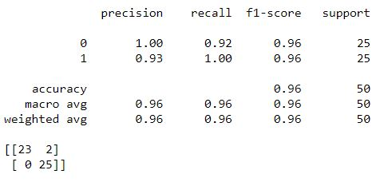

# Finding Kermit

Binary image classification with Tensorflow 2.0

**The Goal**

The goal of this classifier is to identify PMC Team Kermit photos from PMC Non-Kermit photos.  


*note: PMC aka the Pan Mass Challenge is the best charity, supporting the Dana Farber and fighting cancer.  For more information on the PMC, I have provided a link at the bottom of this readme.*

If you find this repo helpful, or if you want to be part of the solution please consider donating to the Pan Mass Challenge

[Donate to the Pan Mass Challenge](https://donate.pmc.org/BM0248/)


Many teams in the PMC decorate their helmets for easy on road identification of team members.  Team Kermit affixes a very distinctive green Kermit doll to the top of their helmets as well as a signature team jersey.  The kermit on the helmet varies from rider to rider and the jersey varies from year to year.


**The Training Images**

I started with a small set of cropped images.  
* training set of roughly 400 images,200 X (2 classes)
* test set of 50 images, 25 X (2 classes) 

then i augmented the training set, using
```
imgaug 
```


I ended up with

* training set of roughly 4070 images,2035 X (2 classes)
* test set of 50 images, 25 X (2 classes) 

as my final set of images

## My Results

The model did ok.


I saved that best model via the checkpoint call back and reloaded that model for the below metrics.


If I set the my threshold at 50%


I was pleasantly surprised at how well the model performed.




If i ratchet up the threshold to 95% I only increase my class 1 precision to .94


## Summary ##
I had a lot of fun with this project.  I was able to use the model and do some classifications on the hold out (test) set.  If I were pouring over tens of thousands of images (which is exactly what happens during and after PMC weekend), looking for my friends on Team Kermit, I believe this model will help me get to the pics quicker.

[Donate to the Pan Mass Challenge](https://donate.pmc.org/BM0248/)

## Running My Code

**Prerequisites**

you need the jupyter notebook
```
finding_team_kermit.ipynb
```
and the images
```
images/
```
and a few basic packages in your environment

* numpy
* pandas
* tensorflow 2.0
* etc...

**Optional Prerequisites**

If you want my exact env, you could re-create it from the provided .yml

```
conda env create -f kermit_environment.yml
```

*note: I didn't create a minimalist env specifically for this project so there will be extra packages in my env that aren't necessary so this is not recommended*


## See Also

* [Donate to the Pan Mass Challenge](https://donate.pmc.org/BM0248/)
* [Visit my linkedIn page](https://www.linkedin.com/in/therealphilwalsh/)
* [Team Kermit](https://profile.pmc.org/tt0079/)
