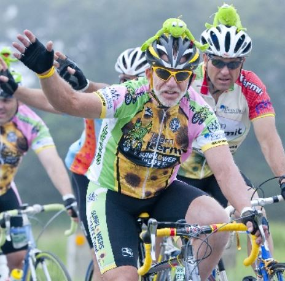
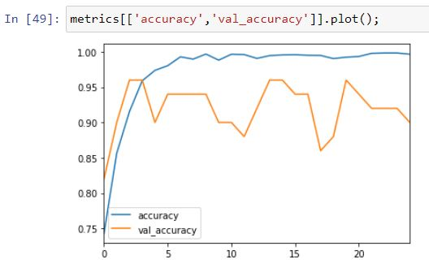

# Finding Kermit

I thought it would be fun to build a binary image classifier  

So I did

**The Goal**

The goal of this classifier is to identify PMC Team Kermit photos from PMC Non-Kermit photos.  




*note: PMC aka the Pan Mass Challenge is the best charity, supporting the Dana Farber and fighting cancer.  For more information on the PMC, I have provided a link at the bottom of this readme.*

Many teams in the PMC decorate their helmets for easy on road identification of team members.  Team Kermit affixes a very distinctive green Kermit doll to the top of their helmets as well as a signature team jersey.  The kermit on the helmet varies from rider to rider and the jersey varies from year to year.


**The Training Images**

I started with a small set of cropped images.  
* training set of roughly 400 images,200 X (2 classes)
* test set of 50 images, 25 X (2 classes) 

then i augmented the training set, using
```
imgaug 
```


I ended up with

* training set of roughly 4070 images,2035 X (2 classes)
* test set of 50 images, 25 X (2 classes) 

as my final set of images

## My Results

The model did ok.




Seemed to have the best fit around epoch 22.

I saved that best model via the checkpoint call back and reloaded that model for the below metrics.


If I set the my threshold at 50%


Only 4 of the 50 were mis-classified

4 in the false negative means 4 Not-Kermit(s) were miss classified as being Kermit

0 false positives means no Kermit(s) were put into the not-Kermit classification


If I set the my threshold at 10%

I am casting a wider net.  trying to classify as many non-phat(s) as I can at the expense of more false positives.


the trade off between recall and precision  

## Summary ##
This was a lot of fun.  I turned a real world data set (images) into a tensorflow 2.0 learning excercise.

## Running My Code

**Prerequisites**

you need the jupyter notebook
```
finding_kermit.ipynb
```
and the images
```
images/
```
and a few basic packages in your environment

* numpy
* pandas
* tensorflow 2.0
* etc...

**Optional Prerequisites**

If you want my exact env, you could re-create it from the provided .yml

```
conda env create -f finding_kermit.yml
```

*note: I didn't create a minimalist env specifically for this project so there will be extra packages in my env that aren't necessary so this is not recommended*


## See Also

* [Visit my linkedIn page](https://www.linkedin.com/in/therealphilwalsh/)
* [Pan Mass Challenge](https://www.pmc.org)
* [Team Phat Tuesday](https://phattuesday.org/)
